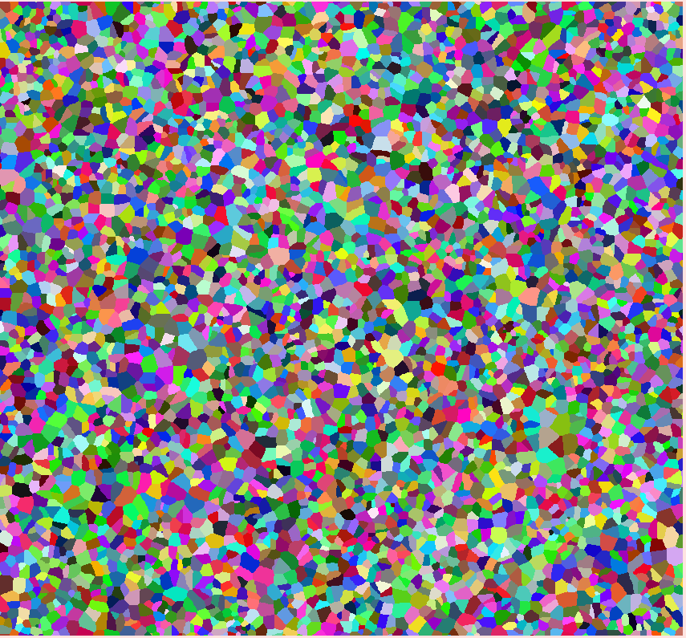
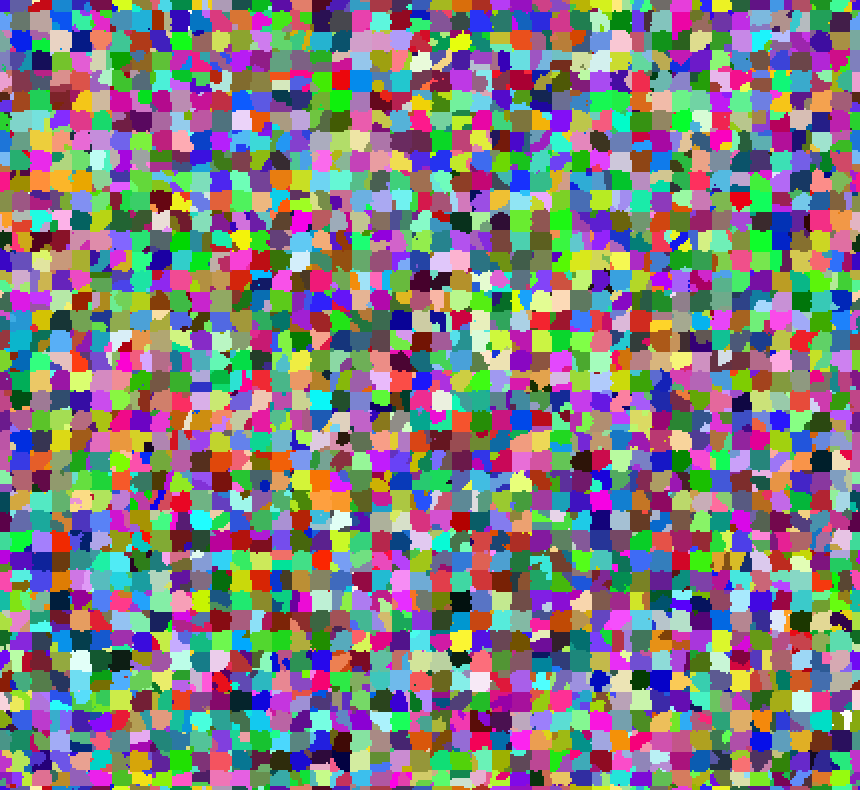
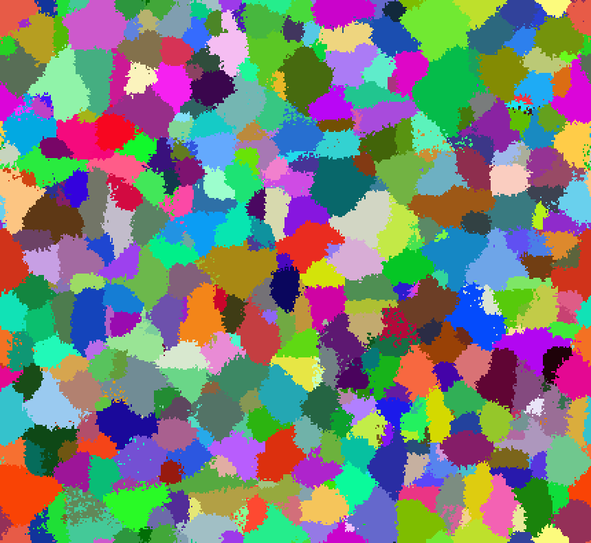
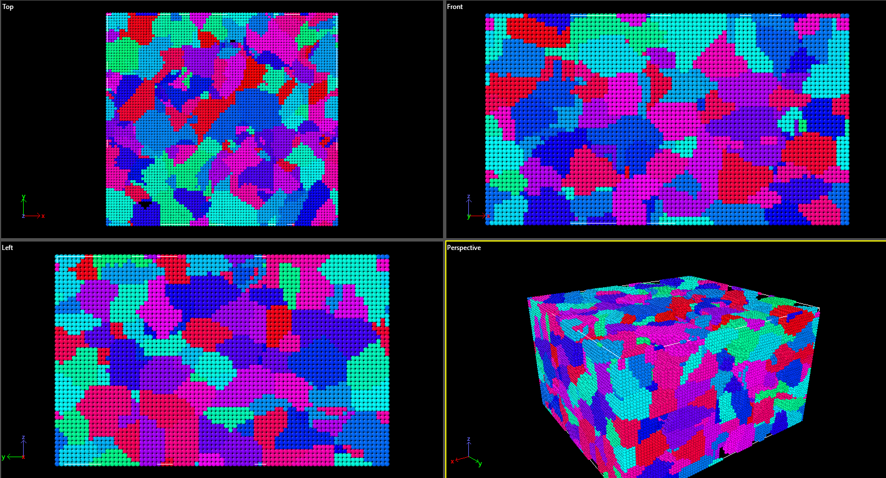

# 3D Grain Growth Simulation with Monte Carlo and Cellular Automata

**A Qt-based C++ application for visualizing and exporting microstructural evolution in 3D using Cellular Automata (CA) and Monte Carlo (MC) methods.**

---

## Features

* **3D Grain Growth**: Hybrid CA + MC algorithm to simulate grain nucleation and evolution.
* **Multiple Neighborhoods**: Support for Von Neumann, Moore, and Hexagonal Random neighborhoods.
* **Monte Carlo Steps**: Adjustable number of MC iterations, with parameters `Jgb` (grain boundary energy) and `kT` (temperature).
* **Real-time Statistics**:

  * Average grain size plotted over iterations.
  * Grain size histogram.
  * Global iteration counter (CA + MC).
* **Interactive GUI**:

  * Place seeds randomly or on a regular grid.
  * Toggle grid display, erase mode, and switch layers.
  * Controls for cell size, neighborhood type, and Monte Carlo settings.
* **Export**:

  * Save 2D snapshots as PNG.
  * Export the full 3D structure in OVITO-compatible text format (excluding empty cells).

## How does it work

## Getting Started

### Prerequisites

* **Qt 6.5.3** with Qt Charts module
* **C++14** compatible compiler

## Usage

1. **Compile** the code.
2. **Seed** grains:

   * "Random": scatter seeds.
   * "Regular": seed on a 3D grid.
3. **Start** CA: the widget will grow grains until the volume is filled.
4. **Perform MC** steps: set desired count, `Jgb`, and `kT`, then re-run.
5. **Monitor** statistics:

   * Average grain size plot.
   * Histogram of grain sizes.
   * Combined iteration count (CA + MC).
6. **Export**:

   * PNG snapshot of current layer.
   * Full 3D structure (OVITO): click **Export OVITO**.

## Example Microstructures

1. Random seeds, combination of all neighborhoods, 10 MC steps.
   
2. Regular seeds, Hexagonal random neighborhood, 10 MC steps (microstructure center - 25/50 layer).
   
3. Random seeds, von Neumann neighborhood, 5 MC + high `kT`, smoothing effect.
   

## Export Format (OVITO)

* Plain `.txt` listing: `x y z grainID r g b` per line, skipping empty cells (`grainID = 0`).
* Load via **File → Import → Text File** in OVITO.

Example 3D microstructure in OVITO

## Contributing

Contributions welcome! Feel free to open issues or PRs.
